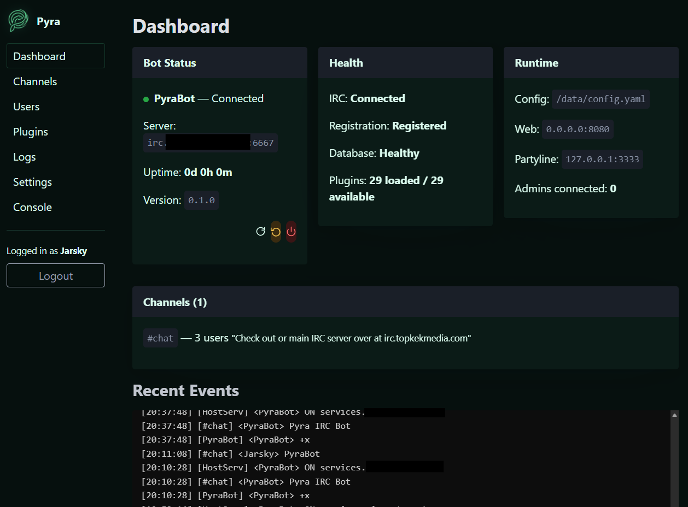
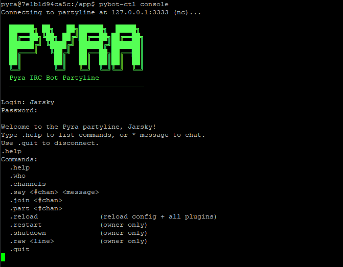
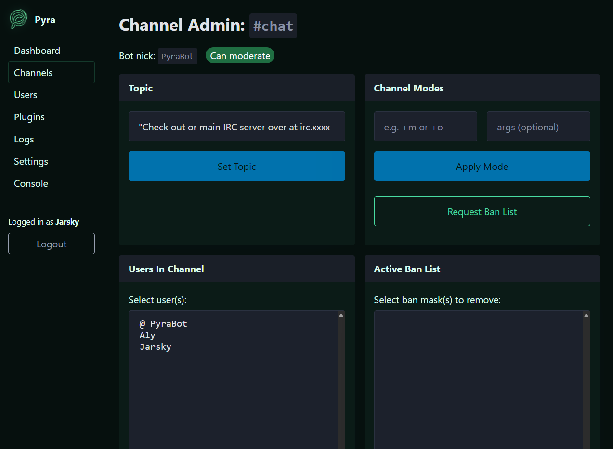
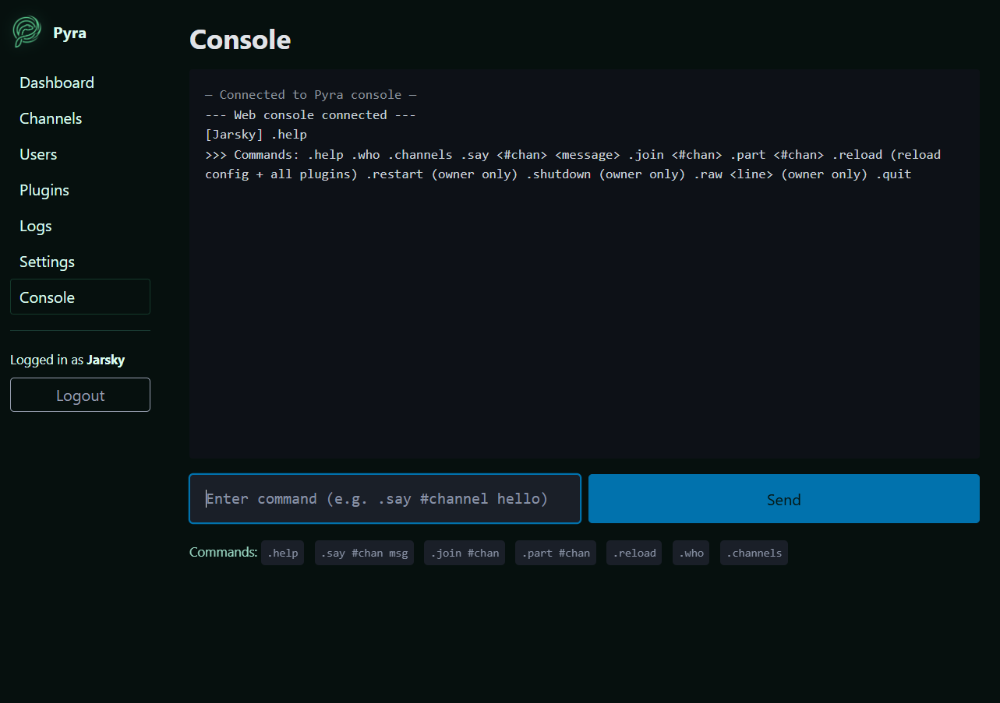

<p align="center">
  
</p>

# Pyra — Modern Python IRC Bot

<p align="center">
  <b>A powerful, extensible, and production-ready IRC bot built with modern Python.</b><br>
  Built with asyncio, FastAPI, SQLAlchemy, and HTMX.
</p>


---

## Features

- **Full IRC/IRCv3 support** — TLS, SASL (PLAIN/EXTERNAL/SCRAM-SHA-256), CAP negotiation, flood protection
- **Async throughout** — single asyncio event loop, no threads
- **Plugin system** — decorator-based API, hot reload via SIGHUP/watchdog, plus Web UI upload and skeleton creation
- **15 built-in plugins** — admin, adminchannel, antispam, calc, choose, ctcp, dice, greet, help, karma, notes, search, seen, tell, uptime
- **Optional extras in plugins_extra/** — headlines, weather, url, arrnotify, invite, movies, lastfm, and more
- **Eggdrop-style permissions** — `n/a/o/v/b/I/X` flags, per-channel overrides, hostmask wildcards
- **Web admin UI** — FastAPI + Jinja2 + HTMX, no Node/React required
- **Partyline** — telnet admin console with multi-user chat, live IRC stream
- **Database** — SQLAlchemy 2.x async, SQLite default, PostgreSQL optional
- **Docker-ready** — Dockerfile, Compose files for both SQLite and PostgreSQL variants

---

## Screenshots

| Web UI | Partyline |
|--------|-----------|
|  |  |

| Channels Admin | Console |
|----------------|---------|
|  |  |

---

## Quick Start

### Basic Docker (recommended)

```bash
git clone https://github.com/Jarsky/pyra.git
cd pyra/docker

# Start — config.yaml is created automatically on first run
docker compose up -d

# Edit the generated config, then restart
$EDITOR ../data/config.yaml
docker compose restart pyra
```

### Native install

```bash
git clone https://github.com/Jarsky/pyra.git
cd pyra

python -m venv venv
source venv/bin/activate          # Windows: venv\Scripts\activate
pip install -e "."

# Interactive setup wizard
pybot-setup

# Start the bot
pybot --config config/config.yaml
```

### Advanced Docker (PostgreSQL + Docker)

```bash
cd pyra/docker

# Set the database password (only required secret)
cp .env.example .env
$EDITOR .env   # set POSTGRES_PASSWORD

# Start — config.yaml is created automatically on first run
docker compose -f docker-compose.prod.yml up -d

# Edit the generated config (server, nick, channels, etc.), then restart
$EDITOR ../data/config.yaml
docker compose -f docker-compose.prod.yml restart pyra
```

---

## Configuration

Run the setup wizard to generate your config:

```bash
pybot-setup
```

Or copy and edit the example manually:

```bash
cp config/config.example.yaml config/config.yaml
$EDITOR config/config.yaml
```

See [docs/config.md](docs/config.md) for full reference.

---

## Plugin Development

Pyra plugins are regular Python files dropped into `plugins_extra/`, with decorator-based hooks for commands, regex rules, and scheduled tasks.

See [docs/plugins.md](docs/plugins.md) for the full plugin API, config examples, and plugin-specific settings under `plugins.vars`.

---

## Permissions

Pyra uses Eggdrop-style flag-based ACL with global and per-channel overrides for owners, admins, ops, voice, ignores, and antispam exemptions.

See [docs/permissions.md](docs/permissions.md) for full reference.

---

## Web Interface

The web UI runs on port `8080` by default:

- **Default login** — on first run, owner login is bootstrapped from config:
  `username = core.owner`, `password = partyline.password`
- **Additional admin logins** — after adding an admin user/flags, set their login password from IRC:
  `!adduser <nick!user@host> <flags>` (auto-generates and /msgs credentials),
  `!setpass <nick> <password>` (owner override), or
  `!passwd <newpassword>` (self-service for admins)

- **Dashboard** — uptime, channels, and recent activity
- **Channels** — settings and moderation controls
- **Users** — user management and flags
- **Plugins** — load/unload/reload, upload new plugin files, create skeleton plugins, edit vars, and edit extra plugin scripts
- **Logs / Console / Settings** — operational admin tools in one place

---

## Partyline

Connect via telnet for a live admin console:

```bash
telnet 127.0.0.1 3333
# or
pybot-ctl console
```

Login credentials are the same as web by default:
`username = core.owner`, `password = partyline.password`.

For non-owner admins, credentials are the same account/password stored in the user DB
(`!setpass` / `!passwd` commands).

Partyline provides a live admin console with bot controls, channel operations, and a real-time IRC event stream.

---

## pybot-ctl

Daemon manager for native deployments:

```bash
pybot-ctl start              # Start the bot
pybot-ctl stop               # Graceful shutdown
pybot-ctl restart            # Stop + start
pybot-ctl status             # PID status
pybot-ctl reload             # Hot-reload all plugins (SIGHUP)
pybot-ctl logs -f            # Follow log output
pybot-ctl console            # Connect to partyline
```

---

## Deployment

See [docs/deployment.md](docs/deployment.md) for:

- Docker stack on `host.domain`
- PostgreSQL production setup
- Systemd service configuration
- nginx reverse proxy for web UI
- SSL certificate setup

---

## Documentation

For end-user and operator guides (beginner through advanced), use the GitHub Wiki:

- [Pyra Wiki](https://github.com/Jarsky/pyra/wiki)

- [Configuration reference](docs/config.md)
- [Deployment guide](docs/deployment.md)
- [Permissions reference](docs/permissions.md)
- [Plugin API and configuration](docs/plugins.md)

---

## Development

```bash
pip install -e ".[dev]"

# Lint + format
ruff check pybot/
black pybot/

# Type check
mypy pybot/

# Tests
pytest tests/ --cov=pybot

# DB migrations
alembic upgrade head
alembic revision --autogenerate -m "describe change"
```

---

## Built-in Plugins

Included built-in plugins cover administration, moderation, antispam, utilities, notes, offline tells, and search.
Optional plugins in `plugins_extra/` include URL titles, weather, headlines, and additional integrations.

See [docs/plugins.md](docs/plugins.md) for plugin details and [plugins_extra/OPTIONAL_PLUGINS.md](plugins_extra/OPTIONAL_PLUGINS.md) for optional extras.

---

## License

MIT — see [LICENSE](LICENSE).
